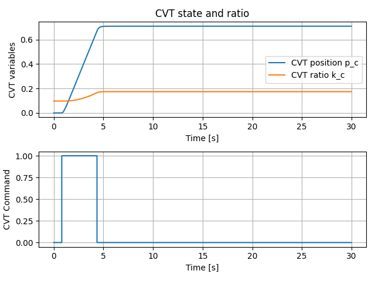
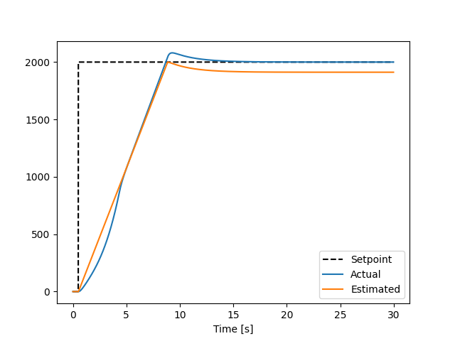
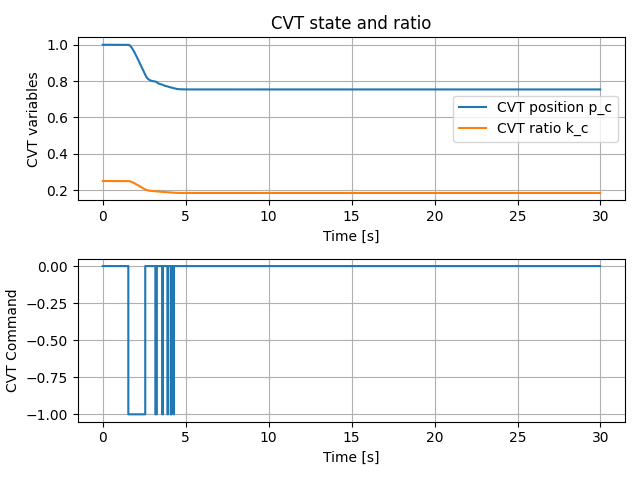
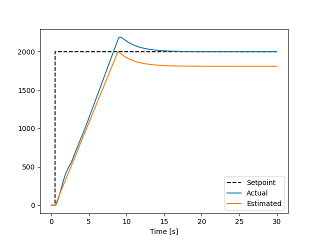

# RotarySMP Spindle control

This repo will cover the Spinde control issue from RotarySMP on youtube [https://www.youtube.com/watch?v=e7l_zo4woV0](https://www.youtube.com/watch?v=e7l_zo4woV0)

I've made some assumptions that I mention in `calculations.ipynb`.

In the video Mark mentioned that he think the biggest issue is the changing inertia of the system when changing the CVT ratio.

That is true, but in my experience VFD's are quite good at speed control, and since we output a speed setpoint to the VFD I think the main issue is that the gear/ratio changes and that the scaling between VFD setpoint and spindle rpm changes too much.

Secondly I think the rate-limit (ramping) done in the VFD also plays a role and needs to be included in the closed loop control in LinuxCNC. Some kind of anti-windup is needed.

## Model

General signal flow


More detailed


Even more detailed


## Open loop simulation

I would say the next step is to know the actual ramp time (rate limit) of the VFD and the nonlinear behaviour between CVT position $p_c$ and CVT gain $k_c$.

When the open-loop simulation is more accurate, a controller / control system can more easily be developed.


## Idea for control concept
Mark mentioned that the ideal scenario is to keep the VFD close to 50 Hz.
I plotted that operating curve and also when prioritizing to keep the CVT in center position.


## Closed loop simulation
Quick control logic I threw togheter similar to Mark's description (`sp_ctrl.py`).

It does the following steps:
1. Set VFD f = 10Hz and calculate the ideal f and cvt gain from the target SP speed.
2. Control CVT to desired position using the estimate from VFD setpoint and spindle encoder
3. Ramp up to ideal VFD freq
4. Use PI control of the RPM based on motor encoder


Right now this need two improvements
1. Anti windup in PI controller (to take the ramp/rate limit into account)
2. Gain scheduling of PI (might not be nesssary if the ideal f is good) -> we can have a slower controller

## Idea 2

Estimate the *ideal ramp*, and adjust CVT position based on that. When the VFD has reached target freq, freeze CVT position and regulate rpm using the VFD.

```
... More to be added...
```

Starting with $p_c = 0.0$ 






Starting with $p_c = 1.0$ W



