# RotarySMP Spindle control

This repo will cover the Spinde control issue from RotarySP on youtube [https://www.youtube.com/watch?v=e7l_zo4woV0](https://www.youtube.com/watch?v=e7l_zo4woV0)

I made some assumptions that I mention in `calculations.ipynb`.

## Model

General signal flow
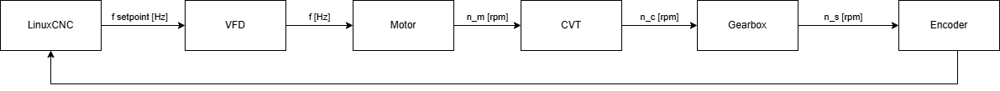

More detailed
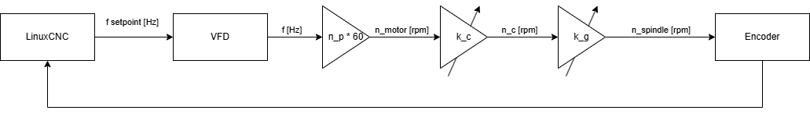

Even more detailed
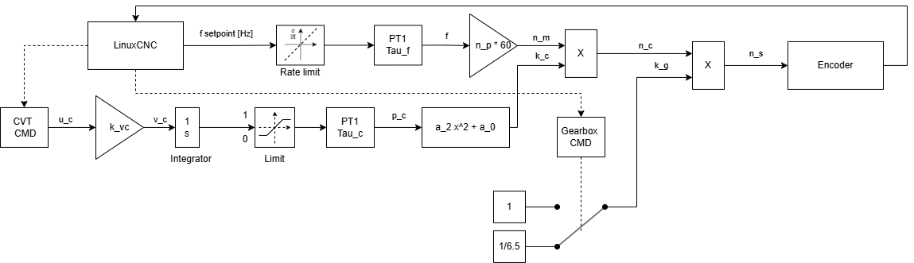

## Open loop simulation

I would say the next step is to know the actual ramp time (rate limit) of the VFD and the nonlinear behaviour between CVT position $p_c$ and CVT gain $k_c$.

When the open-loop simulation is more accurate, a controller / control system can more easily be developed.

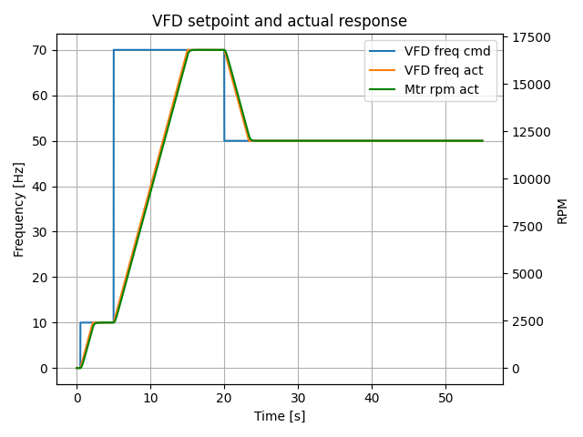

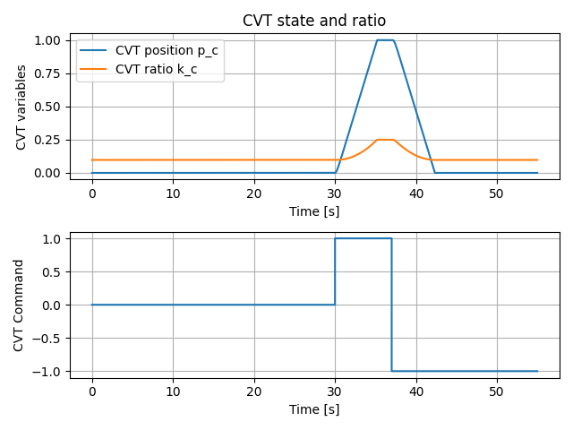

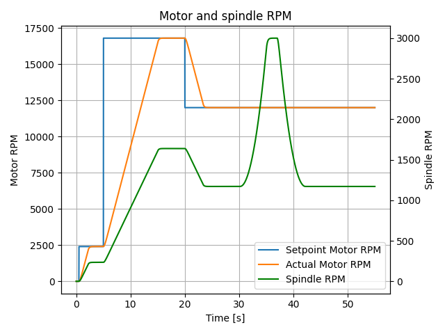

## Idea for control concept
Mark mentioned that the ideal scenario is to keep the VFD close to 50 Hz.
I plotted that operating curve and also when prioritizing to keep the CVT in center position.

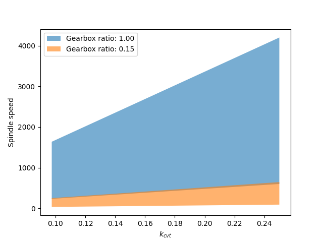

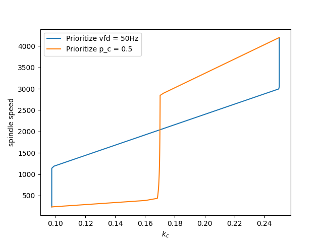

## Closed loop simulation
Quick control logic I threw togheter similar to Mark's description (`sp_ctrl.py`).

It does the following steps:
1. Set VFD f = 10Hz and calculate the ideal f and cvt gain from the target SP speed.
2. Control CVT to desired position using the estimate from VFD setpoint and spindle encoder
3. Ramp up to ideal VFD freq
4. Use PI control of the RPM based on motor encoder

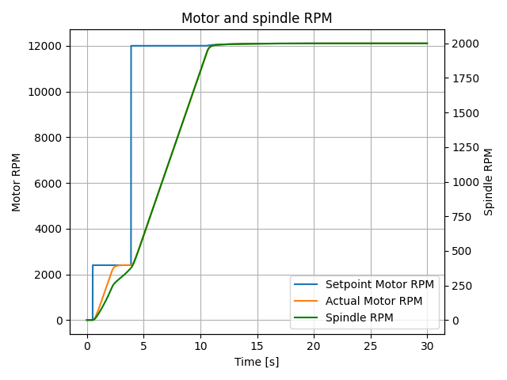

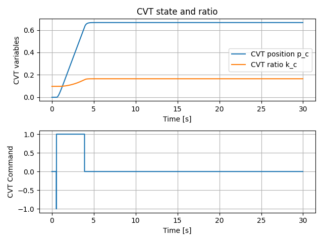

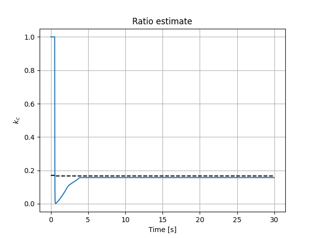

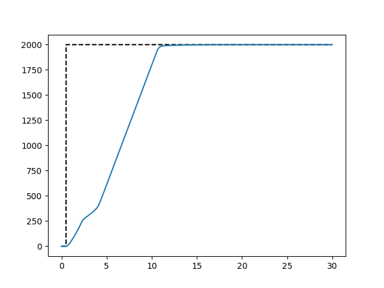

Right now this need two improvements
1. Anti windup in PI controller (to take the ramp/rate limit into account)
2. Gain scheduling of PI (might not be nesssary if the ideal f is good) -> we can have a slower controller
